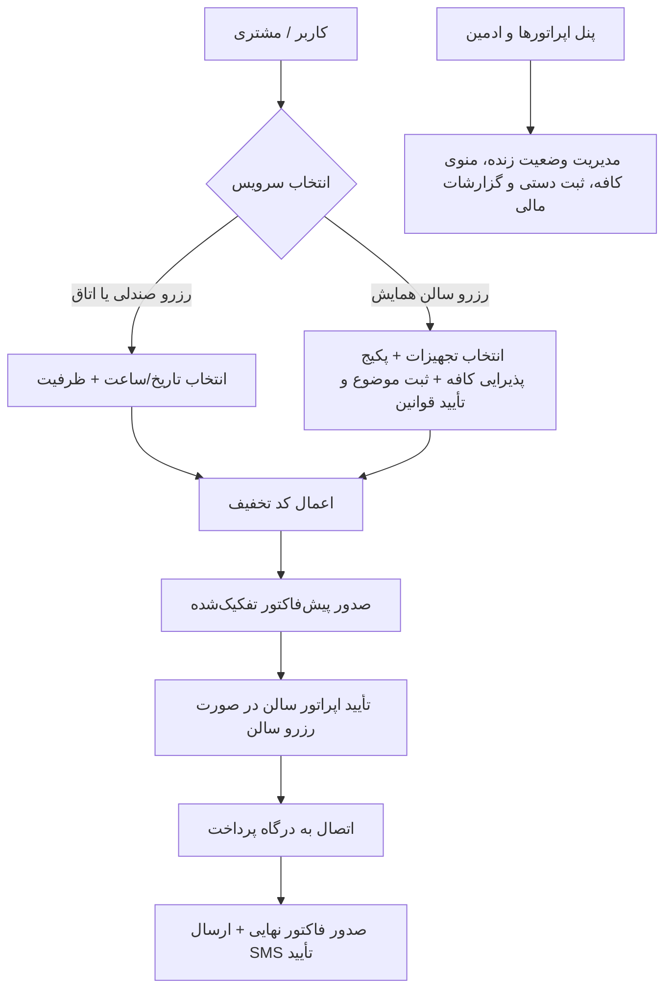

# سند نیازمندی‌ها و مشخصات فنی پروژه TechOn (تکان)

## ۱. مدل داده‌ها (Entities & Schemas)

### Users & Roles
- `User`: id, name, phone, email, national_id, role (`SUPER_ADMIN`, `COWORKING_OPERATOR`, `CAFE_HALL_OPERATOR`, `CUSTOMER`), created_at
- `AuthSession`: token, user_id, expires_at

### Coworking & Spaces
- `Space`: id, name, type (`DEDICATED_DESK`, `SHARED_DESK`, `PRIVATE_ROOM`, `CONFERENCE_ROOM`), capacity, price_hourly, price_daily, price_monthly, status (`AVAILABLE`, `MAINTENANCE`)
- `SpaceReservation`: id, user_id, space_id, start_time, end_time, reservation_type (`HOURLY`, `DAILY`, `MONTHLY`), total_amount, discount_amount, final_amount, status (`PENDING`, `CONFIRMED`, `CANCELLED`, `COMPLETED`), source (`ONLINE`, `PHONE_IN_PERSON`)

### Event Hall & Catering
- `EventHall`: id, name, capacity (60-70), base_hourly_rate, base_daily_rate, rules_text, allowed_topics
- `HallReservation`: id, user_id, topic, attendee_count, start_time, end_time, equipment_ids, catering_items, total_amount, discount_amount, final_amount, status (`PENDING_APPROVAL`, `APPROVED`, `REJECTED`, `PAID`, `CANCELLED`), terms_accepted (boolean)
- `Equipment`: id, name (ویدیو پروژکتور، سیستم صوتی، سن و میکروفن), price_per_slot, is_active
- `CateringItem`: id, title, category (`PACKAGE`, `DRINK`, `SNACK`, `MEAL`), unit_price, is_available, description

### Discounts & Payments
- `DiscountCoupon`: code, type (`PERCENTAGE`, `FIXED_AMOUNT`), value, max_discount, min_order_value, applicable_to (`ALL`, `SEATS`, `ROOMS`, `HALL`, `CAFE`), usage_limit, usage_count, expires_at, is_active
- `Invoice`: id, invoice_number, user_id, reservation_id, reservation_type, items_breakdown, subtotal, discount, vat, total_payable, payment_status (`UNPAID`, `PAID`, `REFUNDED`), created_at
- `PaymentTransaction`: id, invoice_id, gateway_name, tracking_code, reference_id, amount, status (`SUCCESS`, `FAILED`, `PENDING`), log_details, created_at

### Content & Showcase
- `StartupShowcase`: id, name, logo_url, description, team_members_count, category, website_url, order_priority, is_active
- `Post`: id, title, slug, summary, content, cover_image, category (`EVENT`, `NEWS`, `ANNOUNCEMENT`), event_date, published_at

---

## ۲. دیاگرام جریان کاری (Workflows)

